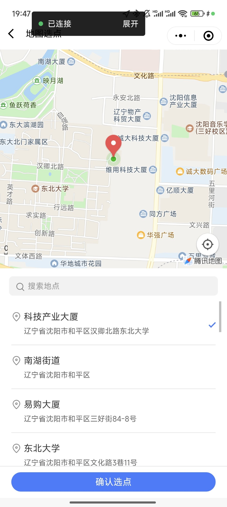
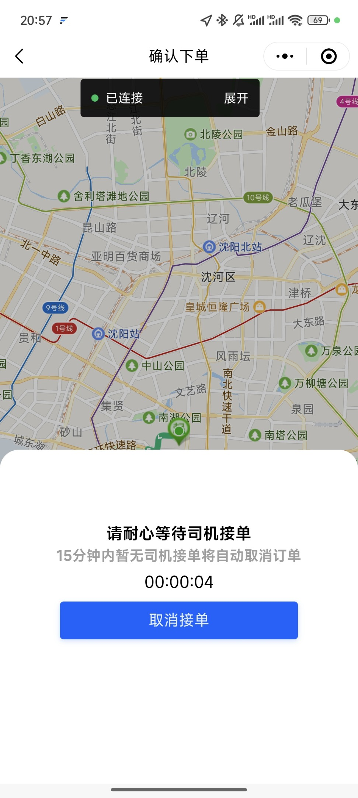
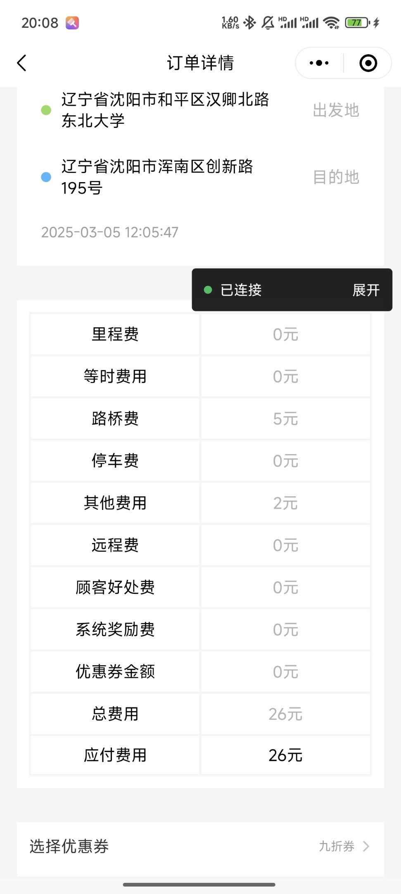
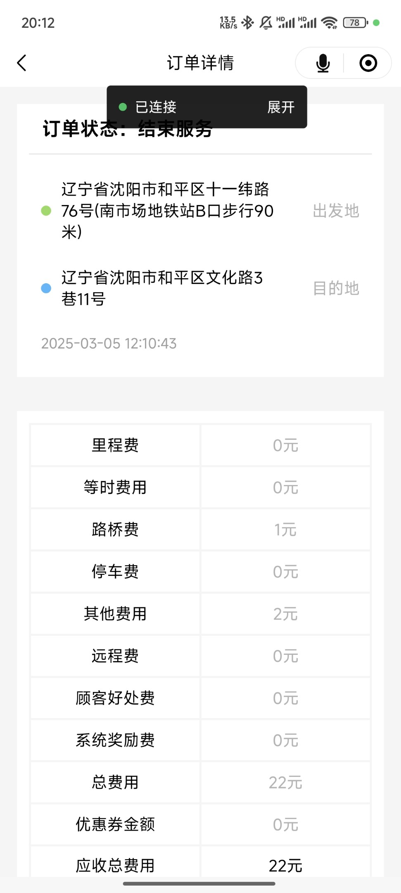

*******
## 后端亮点💡
**技术架构：** **SpringCloudAlibaba 微服务** | **分布式事务** | **高并发场景优化** | **异步高可用设计**

**技术栈：** SpringCloud, MySQL, Redis, RabbitMQ, Nacos, XXL-JOB, MongoDB, MinIO, Drools, Seata, Sentinel, Redisson

### 1. 分布式微服务架构设计：

* **服务治理：** 基于 **SpringCloudAlibaba + Nacos** 实现服务动态注册发现，配置中心实时管理 10+ 微服务；
* **流量治理：** 通过 **SpringCloud Gateway** 统一路由，集成 **Sentinel** 熔断降级策略，接口异常自动熔断；
* **服务通信：** 采用 **OpenFeign** 声明式调用，配合 **SpringCloud LoadBalancer** 负载均衡；
* **权限体系：** 采用 **AOP** + **自定义注解**鉴权方案，在方法执行前后统一进行 token 验证和用户身份校验，实现权限控制。

### 2. 高并发场景优化：

* **订单处理：** 采用 **CompletableFuture 异步编排 + 线程池** 方案，订单结算接口 TP99 从 1200ms 优化至 700ms；
* **抢单防超卖：** **Redisson 分布式锁**（订单 ID 粒度）+ **Redis 原子计数器**，压测验证 500 并发下数据一致性；
* **分布式事务：** **Seata AT 模式** 解决跨服务事务（如“下单→支付→分账”），乐观锁兜底保障最终一致性；
* **消息可靠性：** **RabbitMQ** 异步处理订单状态变更、支付回调，消息可靠性投递（Confirm+Return 机制），本地消息表兜底 MQ
  消息丢失场景（如支付超时未回调），**Redis** 确保消息幂等性。
* **热点数据治理：** **Redis** 实现热点数据缓存，**Redis GEO** 实现司机实时位置索引（5km 内司机匹配响应 <200ms）；

### 3. 其他亮点设计：

* **异步定时调度：** **XXL-JOB** 实现分布式异步定时任务调度，打车发单请求统一管理；
* **云端能力接入：** 调用主流**云服务 API** 实现司机人脸识别、驾驶路线请求、司乘服务录音识别及风险控制；
* **轨迹文档存储：** **MongoDB** 存储司乘服务历史轨迹、录音文字存档；
* **私有对象存储：** **MinIO** 私有部署，存储录音文件、司机认证驾驶证、行驶证、车辆信息等图片，降低存储成本；
* **动态规则引擎：** 集成 **Drools** 动态计算费用规则（如夜间加价、拥堵费），支持实时规则热更新。

# 📱前端场景演示
*（本仓库目前仅包含后端代码，暂未包含前端代码）*
## 一、乘客端

| 首页 | 选择目的地功能 | 浏览优惠券功能 |
| :---: | :---: | :---: |
| |   |   |

| 呼叫订单功能 | 等待司机接单功能 | 等待司机到达功能 |
| :---: | :---: | :---: |
|   |   |   |

| 行程中 | 支付功能 | 查看历史订单功能 |
| :---: | :---: | :---: |
|   |   |   |

## 二、司机端

| 首页 | 等待接单功能 | 抢单功能 |
| :---: | :---: | :---: |
|   |   |   |

| 前往乘客位置功能 | 订单行程中功能 | 收取额外费用功能 |
| :---: | :---: | :---: |
|   |   |   |

| 结账查看费用详情功能 | 订单实时分账功能 | 查看历史订单功能 |
| :---: | :---: | :---: |
|   |   |   |